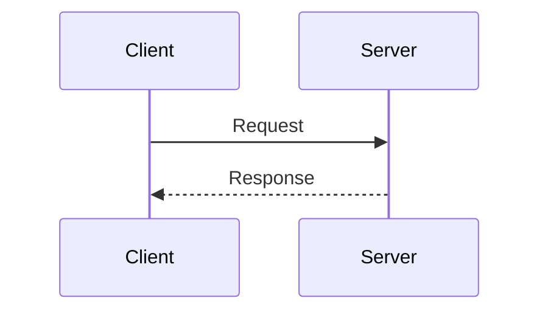

# Client-Server Communication

## Core

The **Client-Server** model is a distributed application structure that partitions tasks or workloads between the providers of a resource or service, called **servers**, and service requesters, called **clients**. It is the most traditional and widely used architecture for network applications.

-   **Client**: A process or application that initiates communication by sending a request to a server. The client is typically a user-facing application, such as a web browser, a mobile app, or a desktop application. It is responsible for the user interface and for forming and sending requests.
-   **Server**: A process or application that listens for and responds to requests from clients. The server is typically a powerful machine that provides a specific service, such as hosting a website, managing a database, or performing business logic. It is responsible for processing requests and returning results.

The communication between the client and the server follows a **request-response** cycle:

1.  The client establishes a connection with the server.
2.  The client sends a request to the server over the network.
3.  The server receives the request, processes it, and may perform some computation or data retrieval.
4.  The server sends a response back to the client.
5.  The client receives the response and processes it.

This interaction is typically **synchronous**, meaning the client blocks (waits) for the response from the server before continuing its execution.

## Trade-offs

### Advantages

-   **Centralization**: Centralized control and data management make it easier to manage, secure, and maintain the system. Updates and maintenance can be performed on the server without affecting the clients.
-   **Scalability**: The server can be scaled vertically (by adding more resources like CPU and RAM) or horizontally (by adding more server machines behind a load balancer) to handle a large number of clients.
-   **Clear Separation of Concerns**: The roles of client and server are distinct, leading to a clean separation of concerns. The client handles the presentation layer, while the server handles the business logic and data layer.

### Disadvantages

-   **Single Point of Failure**: The server is a single point of failure. If the server goes down, the entire system becomes unavailable. This can be mitigated with redundancy, but that adds complexity.
-   **Bottleneck**: The server can become a performance bottleneck if it receives too many requests simultaneously.
-   **Cost**: The server can be expensive to purchase, set up, and maintain, especially for high-traffic applications that require powerful hardware and infrastructure.

## Which service use it?

-   **Web Applications:** The most ubiquitous example, where web browsers (clients) request web pages and resources from web servers.

-   **Email Services:** Email clients (e.g., Outlook, Gmail interface) communicate with email servers (e.g., SMTP, POP3, IMAP servers) to send and receive mail.

-   **File Servers:** Clients access and store files on a central file server (e.g., FTP, SMB/CIFS, NFS).

-   **Database Access:** Applications (clients) connect to a database server to query and manipulate data.

-   **Online Gaming:** Many online games use a client-server model where game clients connect to central game servers for multiplayer interactions and game state management.
