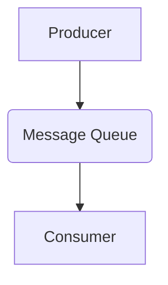
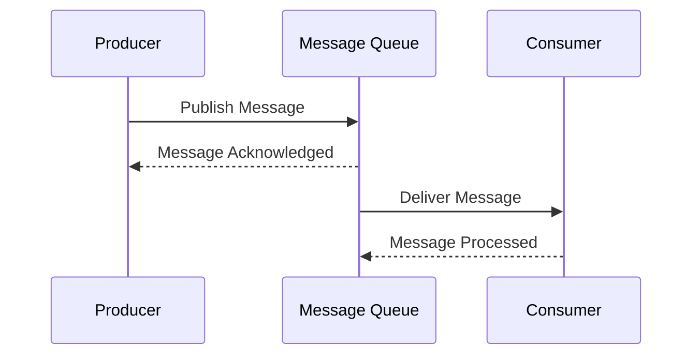

# Message Queue Communication

## Core

The **Message Queue** model is a communication pattern that enables asynchronous communication between distributed components. It is based on the concept of a **queue**, which is a temporary storage for messages.

-   **Producer**: A component that creates and sends messages to the queue.
-   **Consumer**: A component that retrieves and processes messages from the queue.
-   **Queue**: A data structure that stores messages in a first-in, first-out (FIFO) order.

The communication between the producer and the consumer is **asynchronous**, meaning the producer can send a message and continue its execution without waiting for the consumer to process it.

## Trade-offs

### Advantages
-   **Decoupling**: Producers and consumers are decoupled, operating independently without direct knowledge of each other. This enhances modularity and reduces interdependencies.
-   **Reliability**: Messages are persisted in the queue until successfully processed, ensuring data integrity and preventing loss even if consuming services fail temporarily.
-   **Scalability**: Producers and consumers can scale independently based on demand, allowing for flexible resource allocation and improved system performance.
-   **Asynchronous Communication**: Enables non-blocking operations, improving responsiveness for producers and allowing consumers to process messages at their own pace.
-   **Load Leveling**: Queues can buffer messages during peak loads, preventing downstream services from being overwhelmed and ensuring stable performance.

### Disadvantages
-   **Increased Complexity**: Introducing a message queue adds another component to the system architecture, increasing operational overhead and potential points of failure.
-   **Latency**: Messages are not processed instantaneously; they sit in the queue, introducing a delay between production and consumption.
-   **Ordering Guarantees**: While many queues offer FIFO, strict global ordering across multiple consumers or partitions can be challenging to maintain.
-   **Monitoring and Debugging**: Tracing messages through a distributed system with queues can be more complex than direct communication, requiring robust monitoring tools.
-   **Cost**: Setting up and maintaining a message queue infrastructure can incur additional costs, especially for managed services or highly available deployments.

## Which service use it?

-   **Asynchronous Task Processing:** Sending emails, generating reports, processing images, or performing other time-consuming tasks in the background without blocking the user interface.

-   **Decoupling Microservices:** Allowing different microservices to communicate without direct dependencies, improving resilience and scalability.

-   **Buffering and Load Leveling:** Queues can absorb bursts of requests, protecting backend services from being overwhelmed during peak traffic.

-   **Long-Running Batch Jobs:** Distributing large batch processing tasks across multiple workers, where each worker picks up a message (a unit of work) from the queue.

-   **Order Processing Systems:** Ensuring that orders are processed in a reliable and sequential manner, even if some components are temporarily unavailable.
