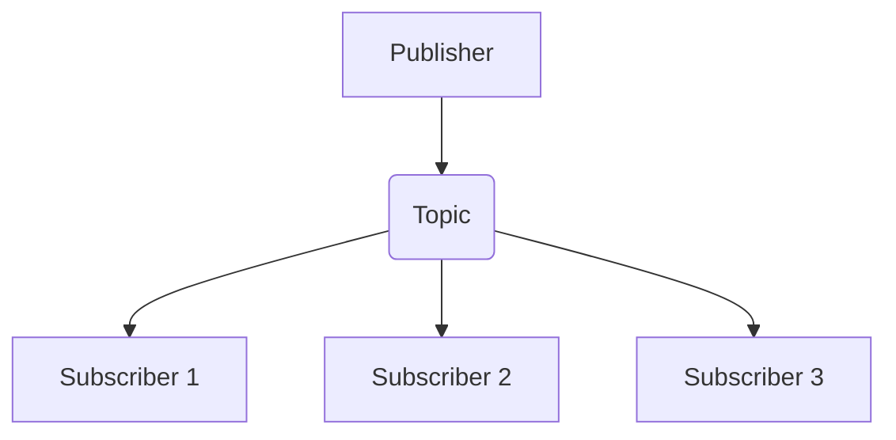

# Publish-Subscribe (Pub/Sub) Communication

## Core

This section explains the Publish-Subscribe (Pub/Sub) communication pattern, where senders (publishers) broadcast messages to an intermediary, and receivers (subscribers) receive messages they are interested in.

## Characteristics

-   **Asynchronous Communication**: Publishers and subscribers operate independently and do not need to be available at the same time.
-   **Loose Coupling**: Publishers and subscribers are decoupled; publishers do not know who the subscribers are, and subscribers do not know who the publishers are.
-   **Scalability**: The system can be scaled by adding more publishers or subscribers.
-   **Flexibility**: New subscribers can be added without affecting existing publishers.

## Comparison

| Feature | Description |
|---|---|
| **Decoupling** | Publishers and subscribers are highly decoupled. |
| **Asynchronicity** | Communication is typically asynchronous. |
| **Scalability** | Can scale to a large number of publishers and subscribers. |
| **Flexibility** | New subscribers can be added without changing publishers. |

## Trade-offs

| Advantages | Disadvantages |
|---|---|
| **Decoupling**: Publishers and subscribers are decoupled and do not need to know about each other. | **Complexity**: The pub/sub system adds another component to the system, which increases the complexity. |
| **Scalability**: The system can be scaled by adding more publishers or subscribers. | **Message Ordering**: Message ordering is not guaranteed. |
| **Flexibility**: New subscribers can be added without affecting existing publishers. | **Message Delivery**: Message delivery is not guaranteed. |

## Which service use it?

-   **Real-time Data Feeds:** Stock market updates, sports scores, and news feeds often use pub/sub to broadcast information to many interested clients simultaneously.

-   **Event Notifications in Microservices:** When a microservice performs an action (e.g., order placed, user registered), it can publish an event that other services subscribe to and react accordingly.

-   **Chat Applications:** Messages sent in a chat room can be published to a topic, and all participants subscribed to that topic receive the message.

-   **IoT Data Ingestion:** IoT devices can publish sensor readings to topics, and various backend services can subscribe to these topics for processing, analytics, or alerts.

-   **Content Delivery Networks (CDNs):** CDNs can use pub/sub to notify edge locations about content updates or invalidations.

## Related Concepts

-   **Communication:** Publish-Subscribe is a key communication pattern in distributed systems, enabling highly decoupled and asynchronous interactions between components by broadcasting messages to interested subscribers. [Explore other Communication Patterns](../README.md).

-   **Messaging:** Pub/Sub is a fundamental messaging pattern that facilitates one-to-many message delivery, allowing multiple consumers to receive the same message without direct knowledge of the publisher. [Explore Messaging Systems](../../messaging/publish-subscribe/README.md).

-   **Message Queue:** In contrast to Publish-Subscribe's one-to-many delivery, Message Queues typically offer one-to-one (point-to-point) message delivery, where each message is consumed by a single receiver. [Compare with Message Queues](../../messaging/message-queue/README.md).

-   **Event-Driven System Mode:** The Publish-Subscribe pattern is a cornerstone of event-driven architectures, where system behavior is primarily driven by the production and consumption of events, enabling reactive and scalable designs. [Discover Event-Driven Systems](../../system-mode/event-driven/README.md).

-   **Event Streaming (Coordination):** Event streaming platforms often leverage the Publish-Subscribe model to provide continuous, real-time data flow and integration, acting as a powerful coordination mechanism. [Explore Event Streaming for Coordination](../../coordination/event-streaming/README.md).
