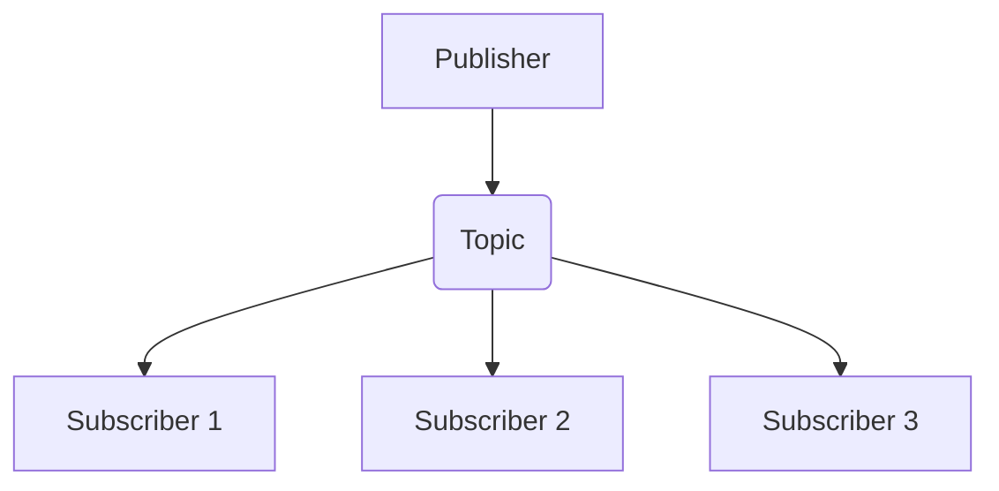

# Publish-Subscribe (Pub/Sub) Communication

## Core

This section explains the Publish-Subscribe (Pub/Sub) communication pattern, where senders (publishers) broadcast messages to an intermediary, and receivers (subscribers) receive messages they are interested in.

## Trade-offs

### Advantages
-   **Decoupling**: Publishers and subscribers operate independently, without direct knowledge of each other, leading to highly modular and maintainable systems.
-   **Scalability**: The system can easily scale by adding more publishers or subscribers without impacting existing components.
-   **Flexibility**: New subscribers can be introduced to consume existing message streams without requiring changes to publishers.
-   **Asynchronous Communication**: Publishers can send messages and continue processing without waiting for subscribers, improving overall system responsiveness.
-   **Event-Driven Architecture**: Naturally supports event-driven patterns, allowing for reactive and responsive systems.

### Disadvantages
-   **Increased Complexity**: Introducing a pub/sub system adds an intermediary layer, increasing the overall system's complexity and potential points of failure.
-   **Message Ordering**: Strict message ordering is often not guaranteed across all subscribers or partitions, which can be a challenge for applications requiring sequential processing.
-   **Message Delivery Guarantees**: Ensuring reliable message delivery (e.g., at-least-once, exactly-once) can be complex and depends heavily on the specific pub/sub implementation.
-   **Monitoring and Debugging**: Tracing message flows and debugging issues in a distributed pub/sub system can be more challenging than in direct communication models.
-   **No Direct Feedback**: Publishers typically don't receive direct feedback on whether messages have been processed by subscribers, which can complicate error handling.

## Which service use it?

-   **Real-time Data Feeds:** Stock market updates, sports scores, and news feeds often use pub/sub to broadcast information to many interested clients simultaneously.

-   **Event Notifications in Microservices:** When a microservice performs an action (e.g., order placed, user registered), it can publish an event that other services subscribe to and react accordingly.

-   **Chat Applications:** Messages sent in a chat room can be published to a topic, and all participants subscribed to that topic receive the message.

-   **IoT Data Ingestion:** IoT devices can publish sensor readings to topics, and various backend services can subscribe to these topics for processing, analytics, or alerts.

-   **Content Delivery Networks (CDNs):** CDNs can use pub/sub to notify edge locations about content updates or invalidations.
