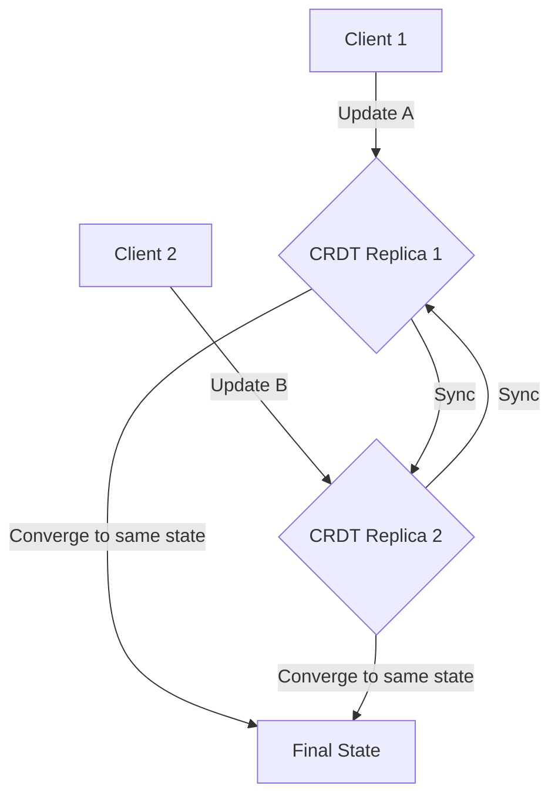

# CRDTs (Conflict-free Replicated Data Types) for Conflict Resolution

This section details how CRDTs are designed to resolve conflicts automatically and deterministically, making them suitable for collaborative and eventually consistent distributed systems.

## Characteristics

- **Conflict-free**: CRDTs are designed to be conflict-free, meaning that they can be updated concurrently without requiring a central authority to resolve conflicts.
- **Convergent**: CRDTs are convergent, meaning that all replicas will eventually converge to the same state.
- **Commutative**: The order in which updates are applied does not matter.
- **Associative**: Updates can be grouped together in any way.
- **Idempotent**: Applying the same update multiple times has the same effect as applying it once.

## Mechanism

CRDTs achieve conflict-freedom through two main approaches:

-   **State-based CRDTs (CvRDTs - Convergent Replicated Data Types)**: Replicas exchange their full local state. The merge function for states must be commutative, associative, and idempotent. This ensures that all replicas eventually converge to the same state regardless of the order of state exchanges.

-   **Operation-based CRDTs (CmRDTs - Commutative Replicated Data Types)**: Replicas broadcast individual operations to each other. These operations must be commutative, meaning their application order does not affect the final state. Operations are typically delivered exactly once and in a causal order.

## Pros & Cons

**Pros:**

-   **Automatic Conflict Resolution:** CRDTs inherently handle conflicts without requiring complex resolution logic or user intervention, simplifying distributed system design.
-   **High Availability and Responsiveness:** Operations can be applied locally without waiting for global consensus, leading to highly available and responsive systems, especially in offline-first scenarios.
-   **Eventual Consistency Guarantees:** All replicas are guaranteed to converge to the same state eventually, providing strong consistency guarantees for the data type.
-   **Scalability:** CRDTs can scale horizontally as they don't rely on a central coordinator for conflict resolution.

**Cons:**

-   **Increased Memory Usage:** State-based CRDTs (CvRDTs) can consume significant memory as they exchange full states, which can grow large over time.
-   **Complexity of Design and Implementation:** Designing and implementing new CRDTs can be challenging, requiring a deep understanding of their mathematical properties.
-   **Limited Data Types:** Not all data types can be easily modeled as CRDTs. Some complex data structures might be difficult to represent in a conflict-free manner.
-   **Garbage Collection Challenges:** Managing and garbage collecting old operations or states in some CRDT implementations can be complex.
-   **No Strong Consistency for Reads:** While writes are eventually consistent, reads might not immediately reflect the latest state across all replicas without additional mechanisms.

## Which service use it?

-   **Collaborative Text Editors:** Applications like Google Docs or Atom Teletype use CRDTs to allow multiple users to edit the same document concurrently without explicit locking, and changes are merged automatically.

-   **Shared Whiteboards and Drawing Applications:** CRDTs can manage concurrent drawing operations, ensuring that all users see a consistent final state.

-   **Distributed Counters and Sets:** In scenarios where multiple nodes need to update a shared counter or a set of items, CRDTs provide a way to do this without conflicts, ensuring eventual consistency.

-   **Multiplayer Games:** CRDTs can be used to synchronize game state across multiple players, especially for elements where concurrent updates are common and need to be resolved smoothly.

-   **Offline-First Applications:** Mobile or web applications that need to function offline and synchronize changes when connectivity is restored can leverage CRDTs for seamless merging of user-generated data.

## Mermaid Diagram

