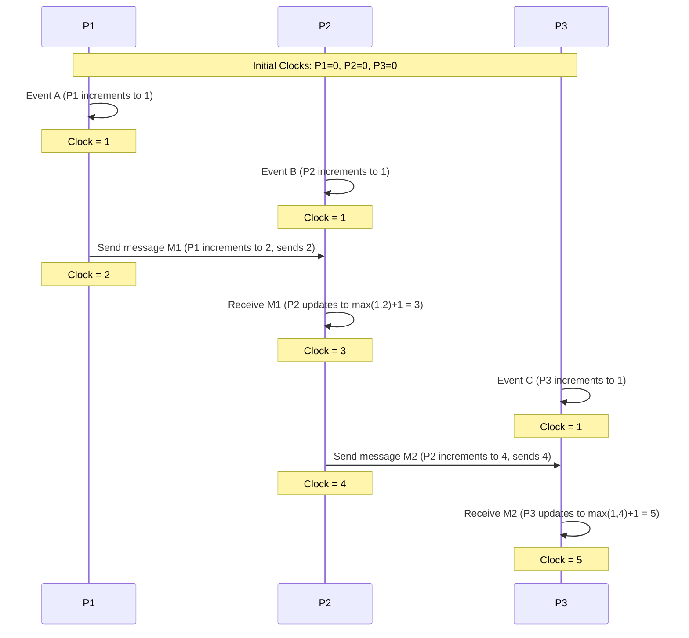

# Timestamps with Logical Clocks for Conflict Resolution

## Core

This section explains how timestamps combined with logical clocks (e.g., Lamport timestamps, Vector Clocks) are used to resolve conflicts in distributed systems by establishing a causal order of events.

### Mechanism: Lamport Timestamps

Lamport timestamps provide a way to define a partial ordering of events in a distributed system, known as the "happened-before" relationship. Each process maintains a local counter (logical clock).

**Rules for updating Lamport Timestamps:**

1.  **Local Event:** When a process executes a local event, it increments its logical clock.
2.  **Sending Message:** When a process sends a message, it first increments its logical clock, then attaches the new timestamp to the message.
3.  **Receiving Message:** When a process receives a message, it updates its logical clock to be `max(current_clock, message_timestamp) + 1`.

This mechanism ensures that if event A happened before event B, then the timestamp of A will be less than the timestamp of B. However, the converse is not necessarily true (i.e., if timestamp A < timestamp B, it doesn't guarantee A happened before B; they could be concurrent).

### Example with Lamport Timestamps

Consider three processes P1, P2, and P3. Each starts with a logical clock value of 0.

In this example, we can see the causal relationships. For instance, Event A (P1=1) happened before the event where P2 received M1 (P2=3). However, Event B (P2=1) and Event C (P3=1) are concurrent, even though their timestamps are equal, demonstrating the partial ordering nature of Lamport clocks.

## Characteristics

- **Causal Ordering**: Logical clocks can establish a partial or total order of events.
- **Conflict Detection**: They can detect concurrent updates and potential conflicts.
- **No Clock Synchronization**: Logical clocks do not require synchronized physical clocks.
- **Overhead**: They introduce overhead in terms of storage and network bandwidth.
- **Complexity**: Logical clocks can be complex to implement and manage.

## Pros & Cons

### Pros
-   **Causal Ordering:** Logical clocks provide a partial or total ordering of events, which helps establish causal relationships.
-   **Conflict Detection:** They can detect concurrent updates and potential conflicts, enabling systems to handle them appropriately.
-   **No Physical Clock Synchronization:** Logical clocks do not rely on perfectly synchronized physical clocks, which is a difficult problem in distributed systems.
-   **Foundation for Consistency:** They are fundamental to achieving various consistency models, especially causal consistency.

### Cons
-   **Overhead:** Implementing and managing logical clocks introduces overhead in terms of storage (for vector clocks) and network bandwidth (for transmitting timestamps).
-   **Complexity:** The implementation and debugging of logical clocks, particularly vector and hybrid clocks, can be complex.
-   **Scalability Challenges (Vector Clocks):** The size of vector clocks grows with the number of nodes, which can be a scalability bottleneck in very large systems.
-   **No Real-Time Accuracy:** Pure logical clocks do not provide real-time accuracy, as they are not tied to wall clock time.
-   **Limited Ordering (Lamport Clocks):** Basic Lamport clocks only provide a partial ordering and cannot distinguish between concurrent events.

## Which service use it?

-   **Distributed Databases:** Many distributed databases use logical clocks (like Lamport timestamps or vector clocks) internally to order events and resolve conflicts, especially in eventually consistent or multi-master replication scenarios.

-   **Event Sourcing Systems:** In event-sourced architectures, logical clocks can be used to ensure the correct ordering of events in the event log, which is crucial for reconstructing the state of an aggregate.

-   **Distributed Transaction Systems:** While complex, some distributed transaction protocols might leverage logical clocks to help in ordering operations and ensuring consistency across multiple participating nodes.

-   **Distributed Caching:** When multiple caches can be updated concurrently, logical clocks can help in determining the most recent version of a cached item.
