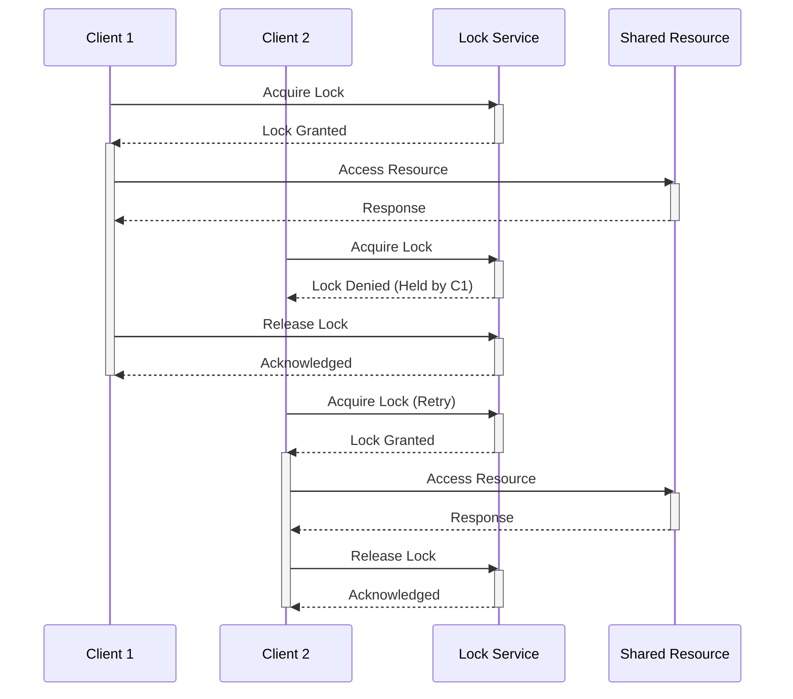

# Distributed Locks

## Core

**Distributed Locks** are a mechanism used in distributed systems to coordinate access to a shared resource or critical section of code among multiple independent processes or nodes. Just like a mutex or semaphore in a single-process environment, a distributed lock ensures that only one process can hold the lock at any given time, thereby preventing race conditions and ensuring data consistency when multiple processes try to modify the same resource concurrently.

Implementing distributed locks correctly is notoriously challenging due to the inherent complexities of distributed systems, such as network partitions, node failures, and varying clock speeds. A poorly implemented distributed lock can lead to deadlocks, data corruption, or reduced availability.

### Key Challenges

-   **Atomicity:** The process of acquiring and releasing a lock must be atomic.
-   **Liveness:** The system must continue to make progress even if a process holding a lock crashes or becomes unresponsive.
-   **Safety:** Only one client can hold the lock at a time.
-   **Fairness:** All clients should eventually be able to acquire the lock.
-   **Performance:** Acquiring and releasing locks should not introduce significant latency or overhead.
-   **Split-Brain:** Preventing a scenario where multiple nodes believe they hold the same lock due to network partitions.

## Characteristics

- **Mutual Exclusion**: Only one process can hold the lock at a time.
- **Deadlock Freedom**: The system should not enter a deadlock state where processes are blocked indefinitely.
- **Fault Tolerance**: The lock service should be resilient to failures.
- **Scalability**: The lock service should be scalable to a large number of clients.
- **Fairness**: All clients should have a fair chance of acquiring the lock.

## Comparison

| Implementation | Complexity | Fault Tolerance |
|---|---|---|
| **Single-Node Redis** | Low | Low |
| **ZooKeeper/etcd** | Medium | High |
| **Relational Databases** | Medium | Medium |
| **Consensus Algorithms** | High | High |

## Trade-offs

- **Performance**: Distributed locks can introduce overhead and reduce performance.
- **Complexity**: Distributed locks can be complex to implement and manage.
- **Single Point of Failure**: The lock service can become a single point of failure.

## Implementation Strategies

-   **Single-Node Redis:** Using Redis as a simple distributed lock manager. While easy to implement, it has a single point of failure. Redlock is an algorithm for achieving a more robust distributed lock with Redis.
-   **ZooKeeper/etcd:** These distributed coordination services are designed to provide strong consistency and are often used to implement robust distributed locks. They typically use consensus algorithms (like ZAB or Raft) internally.
-   **Relational Databases:** Can be used to implement distributed locks using unique constraints or `SELECT ... FOR UPDATE` statements, though this can be less performant and scalable.
-   **Consensus Algorithms (e.g., Paxos, Raft):** Distributed locks can be built on top of these algorithms, which provide strong guarantees about agreement among nodes.

## Which service use it?

-   **Distributed Job Schedulers:** To ensure that a particular job or task is executed by only one worker at a time.
-   **Resource Management Systems:** To control access to shared hardware resources or configuration settings.
-   **Distributed Databases:** For internal coordination, such as leader election or managing schema changes.
-   **Microservices Architectures:** To protect shared resources or prevent duplicate processing of events across different service instances.

