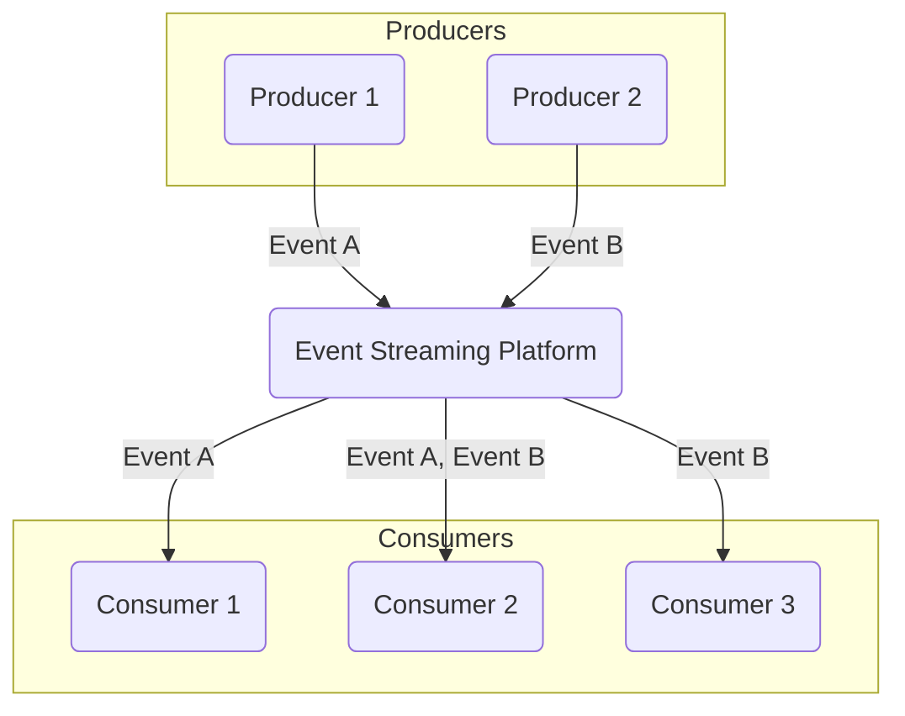

# Event Streaming

This section explores event streaming as a coordination pattern in distributed systems, enabling real-time data flow and integration.

## Characteristics

- **Real-time**: Events are processed in real-time as they are generated.
- **Scalable**: Event streaming platforms are highly scalable and can handle a large volume of events.
- **Durable**: Events are stored in a durable log and can be replayed.
- **Decoupled**: Producers and consumers of events are decoupled and can evolve independently.
- **Ordered**: Events are typically ordered within a partition.

## Comparison

| Feature | Description |
|---|---|
| **Data Flow** | Continuous, real-time flow of events. |
| **Decoupling** | Producers and consumers are highly decoupled. |
| **Scalability** | Highly scalable for high-throughput data. |
| **Durability** | Events are typically persisted for a configurable duration. |

## Pros & Cons 

### Advantages
-   **Real-time Processing:** Enables immediate processing of data as it is generated, crucial for real-time analytics, monitoring, and reactive systems.
-   **High Scalability and Throughput:** Designed to handle massive volumes of events and can scale horizontally to accommodate increasing data loads.
-   **Durability and Replayability:** Events are stored in a persistent, ordered log, allowing for data replay, recovery, and processing by new consumers.
-   **Decoupling:** Producers and consumers are highly decoupled, promoting independent development, deployment, and evolution of services.
-   **Fault Tolerance:** With proper configuration, event streaming platforms are highly fault-tolerant, ensuring data is not lost even if nodes fail.
-   **Auditability:** The immutable log of events provides a complete audit trail of all changes and actions within the system.

### Disadvantages
-   **Increased Complexity:** Setting up, configuring, and managing an event streaming platform can be complex and requires specialized knowledge.
-   **Operational Overhead:** Requires significant operational effort for monitoring, maintenance, and ensuring high availability.
-   **Potential for Latency:** While often real-time, latency can be introduced by network delays, processing bottlenecks, or batching strategies.
-   **Cost:** Operating event streaming infrastructure, especially at scale, can be expensive due to hardware, software licenses, and operational costs.
-   **Data Governance Challenges:** Managing data schemas, evolution, and ensuring data quality across numerous event types and consumers can be challenging.
-   **Debugging and Troubleshooting:** Tracing event flows and debugging issues in a distributed event-driven system can be more difficult than in traditional request-response architectures.

## Which service use it?

-   **Real-time Analytics and Monitoring:** Event streaming platforms are used to ingest and process massive volumes of real-time data (e.g., user clicks, sensor readings, application logs) for immediate insights and anomaly detection.

-   **IoT Data Processing:** Ingesting and processing data from a multitude of IoT devices, enabling real-time reactions and data analysis at scale.

-   **Microservices Communication:** Event streaming serves as a backbone for asynchronous communication between microservices, allowing them to react to events generated by other services without tight coupling.

-   **Change Data Capture (CDC):** Capturing changes from databases in real-time and streaming them to other systems (e.g., data warehouses, search indexes) to keep them up-to-date.

-   **Fraud Detection:** Analyzing streams of financial transactions in real-time to identify and flag suspicious activities.

-   **Personalization and Recommendation Engines:** Processing user behavior events in real-time to provide personalized content and product recommendations.

