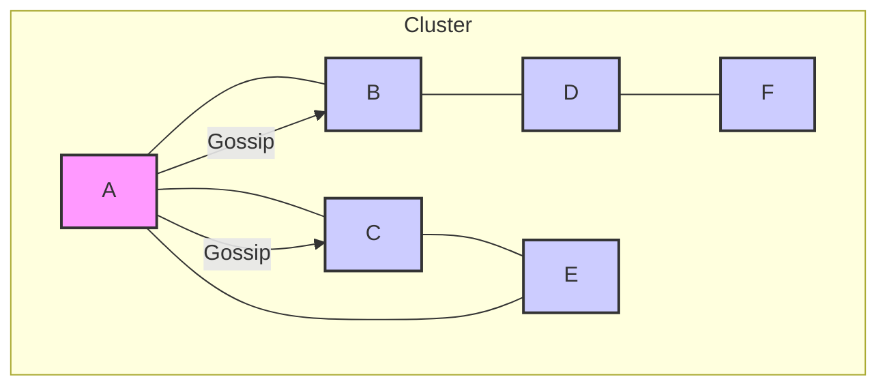

# Gossip Protocol

## Core

The Gossip protocol, also known as the epidemic protocol, is a style of computer-to-computer communication inspired by the way diseases spread or rumors circulate among humans. In a distributed system, nodes periodically exchange information with a small, randomly selected set of other nodes. This decentralized communication pattern ensures that information eventually propagates throughout the entire network without relying on a central coordinator. It's commonly used for tasks like membership management, failure detection, and data dissemination due to its robustness, scalability, and fault tolerance.

## Characteristics

- **Decentralized**: There is no central coordinator; all nodes are equal.
- **Scalable**: The protocol scales well to a large number of nodes.
- **Fault-tolerant**: The protocol is resilient to node failures and network partitions.
- **Eventually consistent**: Information eventually propagates to all nodes in the network.
- **Lightweight**: The protocol is lightweight and does not require a lot of resources.

## Comparison

| Feature | Description |
|---|---|
| **Decentralization** | No central coordinator. |
| **Robustness** | Highly resilient to node failures and network partitions. |
| **Scalability** | Scales well to a large number of nodes. |
| **Convergence** | Information eventually propagates throughout the network. |

## Trade-offs

| Advantages | Disadvantages |
|---|---|
| **Decentralized**: There is no central coordinator; all nodes are equal. | **Latency**: Information propagation can be slow. |
| **Scalable**: The protocol scales well to a large number of nodes. | **Message Overhead**: The protocol can generate a lot of network traffic. |
| **Fault-tolerant**: The protocol is resilient to node failures and network partitions. | **Ordering**: The protocol does not guarantee message ordering. |

## Which service use it?

-   **Apache Cassandra:** Cassandra uses a gossip protocol for node discovery, membership management, and failure detection within its cluster. This allows nodes to quickly learn about the state of other nodes and recover from failures.

-   **Riak:** Riak, a distributed NoSQL database, also leverages gossip for cluster membership and to disseminate information about data partitions and node health.

-   **Cluster Membership Services (e.g., HashiCorp Serf):** Tools like Serf use gossip protocols to provide decentralized cluster membership, failure detection, and orchestration across dynamic infrastructures.

-   **Distributed Caching Systems:** Some distributed caches might use gossip to propagate cache invalidations or updates across the cluster in a fault-tolerant manner.

-   **Peer-to-Peer Networks:** Gossip protocols are fundamental to many P2P systems for disseminating information and maintaining network health without central coordination.

