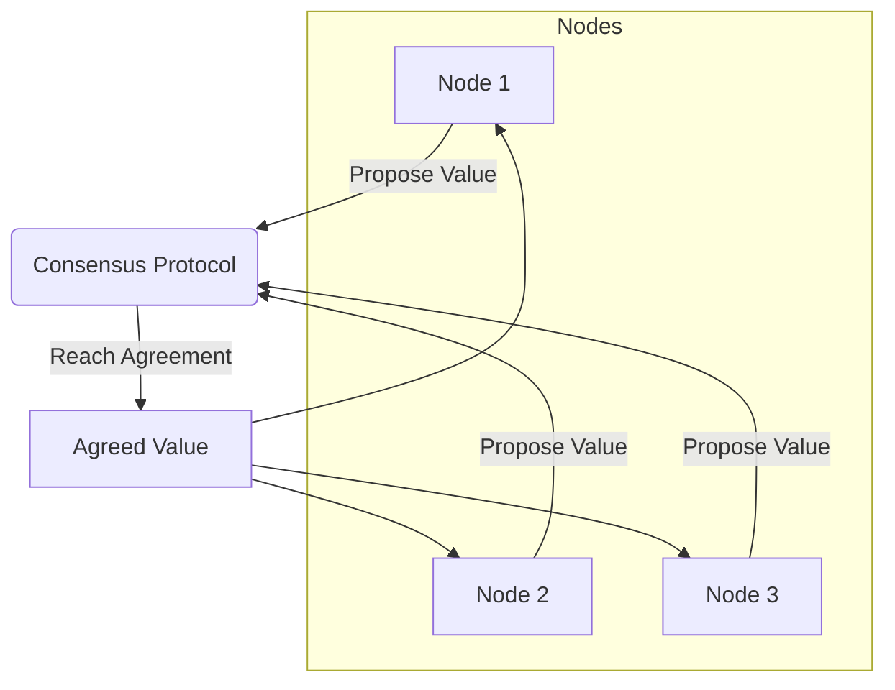

# Distributed Consensus

## Core

This section discusses consensus mechanisms specifically in the context of distributed coordination.

## Characteristics

- **Agreement**: All non-faulty processes agree on the same value.
- **Validity**: If all non-faulty processes propose the same value, then all non-faulty processes will decide on that value.
- **Termination**: All non-faulty processes eventually decide on a value.
- **Fault Tolerance**: The consensus algorithm is resilient to a certain number of process failures.
- **Asynchrony**: The consensus algorithm is designed to work in an asynchronous network.

## Comparison

| Algorithm | Understandability | Fault Tolerance | Performance | Use Case |
|---|---|---|---|---|
| **[Paxos](./paxos)** | Low | High | Medium | Critical systems, high-consistency requirements |
| **[Raft](./raft)** | High | High | Medium | Distributed key-value stores, coordination services |

## Trade-offs

- **Performance**: Consensus algorithms can have high latency due to the need for multiple rounds of communication.
- **Complexity**: Consensus algorithms can be complex to implement and understand.
- **Scalability**: The scalability of consensus algorithms is limited by the number of processes.

## Which service use it?

-   **Distributed Databases (e.g., Google Spanner, CockroachDB):** These databases use consensus algorithms (like Paxos or Raft) to ensure that all replicas agree on the state of the data, enabling strong consistency and fault tolerance.

-   **Distributed Coordination Services (e.g., Apache ZooKeeper, etcd):** These services are built on consensus protocols to provide a consistent and highly available shared state for distributed applications, used for leader election, configuration management, and service discovery.

-   **Leader Election:** In many distributed systems, a leader needs to be elected to coordinate tasks or handle writes. Consensus algorithms are used to reliably elect a single leader among a group of nodes.

-   **Distributed Transactions:** While complex, some distributed transaction protocols (e.g., Two-Phase Commit) aim to achieve consensus among participating nodes to either commit or abort a transaction atomically.

-   **State Machine Replication:** Systems that replicate a state machine across multiple nodes use consensus to ensure that all nodes process the same sequence of commands in the same order, maintaining a consistent state.

## Related Concepts

-   **Strong Consistency:** Distributed consensus algorithms are fundamental for achieving strong consistency in distributed systems, ensuring that all replicas agree on the order of operations and the state of the data. [Learn more about Strong Consistency](../consistency-models/strong-consistency/README.md).

-   **Fault Tolerance:** Consensus protocols are inherently designed to tolerate failures (e.g., node crashes, network partitions) and ensure the system can continue to operate and make progress even in the presence of faults. [Understand Fault Tolerance](../fault-tolerance/README.md).

-   **Distributed Transactions:** While challenging, some distributed transaction protocols, such as Two-Phase Commit, utilize consensus-like mechanisms to ensure atomicity across multiple participating nodes. [Explore Distributed Transactions](../distributed-transactions/README.md).

-   **Coordination:** Consensus is a core mechanism for coordination in distributed systems, enabling nodes to agree on shared states, elect leaders, and manage distributed locks. [Discover Coordination Concepts](../coordination/README.md).

-   **Paxos:** A foundational, albeit complex, algorithm for achieving distributed consensus, known for its strong theoretical guarantees. [Understand Paxos ./paxos/README.md].

-   **Raft:** A consensus algorithm designed for understandability, often preferred over Paxos for its clarity and ease of implementation in practical systems. [Understand Raft ./raft/README.md].
