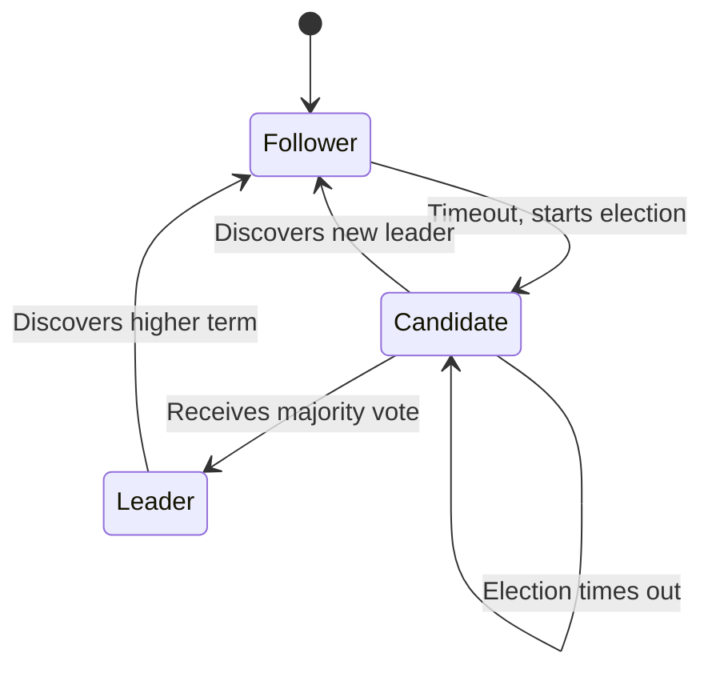

# Raft

**Raft** is a consensus algorithm designed to be understandable and to provide fault tolerance in distributed systems. It is equivalent to Paxos in terms of fault tolerance and performance but is structured to be more comprehensible for humans, making it easier to implement and reason about. Raft ensures that all nodes in a distributed system agree on the same sequence of state changes, even in the presence of node failures or network partitions.

### Key Concepts

-   **States:** Each server in a Raft cluster is in one of three states: Leader, Follower, or Candidate.

-   **Leader:** Handles all client requests (if it's a client-facing system), replicates log entries to followers, and sends heartbeats to maintain its leadership.
-   **Follower:** Passive, responds to requests from leaders and candidates. If a follower receives no communication for a period, it becomes a candidate.
-   **Candidate:** Initiates an election to become the new leader.
-   **Log:** A sequence of commands that are applied to the state machine. All log entries are numbered with term numbers and their index in the log.

### Key Challenges

-   **Network Partitions:** Handling situations where nodes are isolated from each other due to network failures.
-   **Performance:** While simpler than Paxos, Raft still incurs latency due to the need for consensus on every state change.

## Characteristics

- **Understandability**: Raft is designed to be easy to understand.
- **Strong Leader**: Raft uses a strong leader to simplify the management of the replicated log.
- **Leader Election**: Raft uses a randomized timer to elect a leader.
- **Membership Changes**: Raft supports adding and removing servers from the cluster.
- **Log Compaction**: Raft supports log compaction to reduce the size of the log.

## Comparison

| Algorithm | Understandability | Performance |
|---|---|---|
| **Raft** | High | High |
| **Paxos** | Low | High |

## Trade-offs

- **Performance**: Raft can have lower throughput than other consensus algorithms in some cases.
- **Complexity**: Raft is simpler than Paxos, but it is still a complex algorithm.
- **Flexibility**: Raft is less flexible than Paxos.

## How It Works

Raft operates in terms of *terms*, which are continuously increasing integers. Each term begins with an election, and if an election is successful, a single leader manages the cluster for the rest of the term.

1.  **Leader Election:**
    *   When a follower times out (doesn't receive heartbeats from the leader), it becomes a candidate and starts a new election term.
    *   It votes for itself and sends `RequestVote` RPCs to all other servers.
    *   If a candidate receives votes from a majority of servers, it becomes the leader.
    *   If multiple candidates vie for leadership, a split vote can occur, leading to another election term with randomized timeouts to resolve the tie.

2.  **Log Replication:**
    *   The leader receives client commands and appends them as new entries to its log.
    *   It then issues `AppendEntries` RPCs to all followers, instructing them to replicate the new log entries.
    *   Once an entry is safely replicated to a majority of followers, the leader applies it to its state machine and responds to the client.

3.  **Safety:** Raft ensures several safety properties, most notably that if a leader has committed a log entry in a given term, then all subsequent leaders will also have that log entry.

## Which service use it?

-   **etcd:** A distributed key-value store that uses Raft for strong consistency, commonly used for Kubernetes coordination.
-   **Consul:** A service networking solution that uses Raft for its distributed state store.
-   **CockroachDB:** A distributed SQL database that uses a variant of Raft (called Raft-based replication) for data consistency and fault tolerance.
-   **TiKV:** A distributed transactional key-value database that uses Raft for data replication and consistency.

