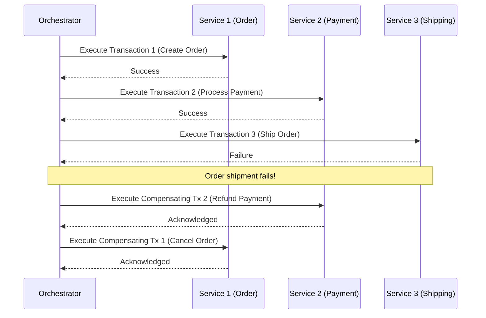

# Saga Pattern

The **Saga Pattern** is a way to manage transactions that span multiple services in a distributed system, ensuring data consistency without using traditional distributed transactions (like Two-Phase Commit). It's particularly well-suited for microservices architectures where services have their own databases and strong ACID guarantees across services are difficult to achieve.

A Saga is a sequence of local transactions, where each local transaction updates its own database and publishes an event. If a local transaction fails, the Saga executes a series of compensating transactions to undo the changes made by the preceding local transactions.

### Key Principles

-   **Local Transactions:** Each step in a Saga is a local ACID transaction within a single service.
-   **Events:** Services communicate by publishing and subscribing to events.
-   **Compensating Transactions:** For every local transaction that modifies data, there's a corresponding compensating transaction that can undo its effects.
-   **Eventual Consistency:** Sagas achieve eventual consistency across the distributed system.

### Saga Orchestration

There are two main ways to coordinate Sagas:

1.  **Choreography:** Each service produces and listens to events, and decides what to do next without a central coordinator. This is decentralized and can be more resilient but harder to monitor and manage complex workflows.
2.  **Orchestration:** A central orchestrator (or Saga execution coordinator) tells each participant service what local transaction to execute. The orchestrator manages the sequence of steps and executes compensating transactions if a step fails. This provides a clearer view of the Saga's progress and simplifies error handling.

## Characteristics

- **Eventual Consistency**: Sagas provide eventual consistency, not atomic consistency.
- **Compensating Transactions**: Sagas rely on compensating transactions to undo changes in case of a failure.
- **Asynchronous**: Sagas are typically asynchronous and event-driven.
- **Decentralized**: Sagas can be implemented in a decentralized way using choreography.
- **Long-Lived**: Sagas can be long-lived transactions that span multiple services.

## Comparison

| Feature | Saga | 2PC |
|---|---|---|
| **Consistency** | Eventual | Strong |
| **Coupling** | Loose | Tight |
| **Complexity** | High | Medium |

## Trade-offs

-   **Eventual Consistency:** Sagas provide eventual consistency, meaning that at any given point, the system might be in an inconsistent state until all local transactions and potential compensating transactions are completed.
-   **Increased Complexity in Error Handling:** Implementing compensating transactions and ensuring their correctness can be complex, as it requires careful design of the undo logic for each step.
-   **No Global Rollback:** Unlike traditional distributed transactions, there is no automatic global rollback. Instead, the system relies on compensating actions.
-   **Monitoring Challenges:** Especially with choreography, tracking the progress and state of a Saga across multiple services can be challenging without proper tooling.

## Use Case

-   **Microservices Architectures:** Widely adopted in modern microservices architectures (e.g., e-commerce platforms, order processing systems) to maintain data consistency across multiple services without using distributed transactions.
-   **Long-Running Business Processes:** Ideal for complex business workflows that involve multiple steps and services, where immediate global consistency is not strictly required.
-   **Systems Prioritizing Availability:** When high availability and partition tolerance are more critical than strong consistency, Sagas offer a viable alternative to blocking distributed transactions.

