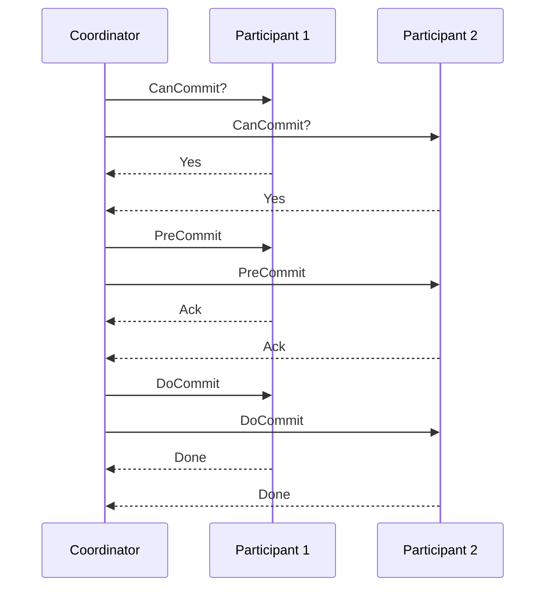
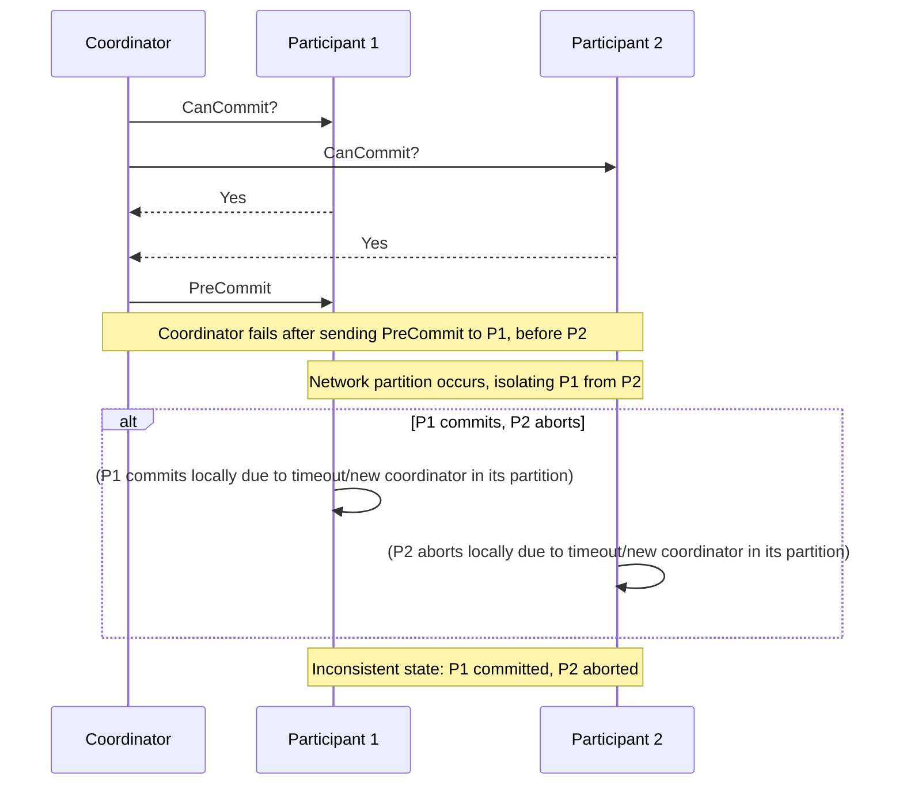

# Three-Phase Commit (3PC)

**Three-Phase Commit (3PC)** is an atomic commitment protocol designed to address some of the blocking issues inherent in Two-Phase Commit (2PC), particularly in the event of a coordinator failure. It adds an extra phase to 2PC to ensure that participants are not left in an uncertain state if the coordinator crashes after sending a commit message but before all participants receive it.

Like 2PC, 3PC involves a coordinator and multiple participants. It operates in three distinct phases:

### Phase 1: CanCommit? Phase

1.  **Coordinator sends CanCommit? message:** The coordinator sends a "CanCommit?" message to all participants, asking if they are ready to commit the transaction.
2.  **Participants respond:** Each participant performs necessary checks and, if ready, replies with a "Yes" message. Otherwise, it replies with a "No" message.

### Phase 2: PreCommit Phase

1.  **Coordinator collects responses:**
    *   **If all participants respond "Yes":** The coordinator sends a "PreCommit" message to all participants.
    *   **If any participant responds "No" (or fails to respond within a timeout):** The coordinator sends an "Abort" message to all participants, and the transaction is aborted.
2.  **Participants prepare to commit:** Upon receiving "PreCommit," participants prepare to commit the transaction (e.g., by writing to stable storage) and send an "Ack" message to the coordinator.

### Phase 3: DoCommit Phase

1.  **Coordinator collects Acks:**
    *   **If all participants send "Ack":** The coordinator sends a "DoCommit" message to all participants.
    *   **If any participant fails to send "Ack" (or fails to respond within a timeout):** The coordinator sends an "Abort" message to all participants, and the transaction is aborted.
2.  **Participants commit:** Upon receiving "DoCommit," participants commit the transaction and release resources. They then send a "Done" message to the coordinator.

## Characteristics

- **Non-blocking**: 3PC is non-blocking in the case of a coordinator failure, as participants can reach a consistent decision.
- **Atomic**: All participants either commit or abort the transaction.
- **Consistent**: The protocol ensures that all participants reach a consistent decision.
- **Durable**: The outcome of the transaction is durable, even in the case of failures.
- **Complex**: 3PC is more complex than 2PC, as it involves an extra phase.

### Worst Case Scenario

While 3PC aims to be non-blocking, its worst-case scenario arises primarily from **network partitions combined with coordinator failures**. If a network partition occurs, isolating the coordinator from a subset of participants, and the coordinator then fails, the non-blocking guarantee can be violated. For example, if the coordinator sends a `PreCommit` message to a participant, then the network partitions, and the coordinator fails, the isolated participant might decide to commit (assuming the coordinator failed and it was safe to proceed), while other participants in a different partition might decide to abort (if a new coordinator is elected in their partition and doesn't see the `PreCommit` from the original coordinator). This can lead to an inconsistent state where some participants commit and others abort, violating atomicity. 3PC relies on strong assumptions about bounded network delays to prevent this, which are often difficult to guarantee in real-world distributed systems.

## ## Pros & Cons

### Pros
-   **Non-blocking (Improved):** Designed to be non-blocking in the event of a coordinator failure, allowing participants to reach a consistent decision without indefinite waiting, unlike 2PC.
-   **Reduced Blocking Scenarios:** Mitigates some of the blocking issues of 2PC by introducing the "PreCommit" phase, which allows participants to commit even if the coordinator fails after sending PreCommit.
-   **Data Consistency:** Like 2PC, it ensures atomicity and consistency across distributed transactions.

### Cons
-   **Increased Complexity:** Significantly more complex to implement and manage than 2PC due to the additional phase and state transitions.
-   **Higher Message Overhead:** The extra phase (PreCommit) means more messages exchanged between the coordinator and participants, leading to increased network traffic and latency.
-   **Strong Assumptions:** Relies on strong assumptions about bounded network delays and node response times, which may not hold true in real-world, unpredictable distributed environments.
-   **Not Fully Non-blocking:** While improved, it can still block under certain failure scenarios, particularly during network partitions where it might be indistinguishable from multiple site failures.
-   **Limited Practical Adoption:** Due to its complexity and remaining vulnerabilities, 3PC is rarely implemented in practical systems; 2PC or alternative patterns like Saga are more common.

## Use Case

-   **Systems where blocking is unacceptable:** 3PC is considered in scenarios where the blocking nature of 2PC is deemed too detrimental, and a non-blocking guarantee is highly desired, even at the cost of increased complexity and overhead.
-   **Distributed databases:** Some distributed database systems might implement variations of 3PC to improve availability during coordinator failures, though it is less commonly adopted than 2PC due to its complexity and remaining vulnerabilities.

