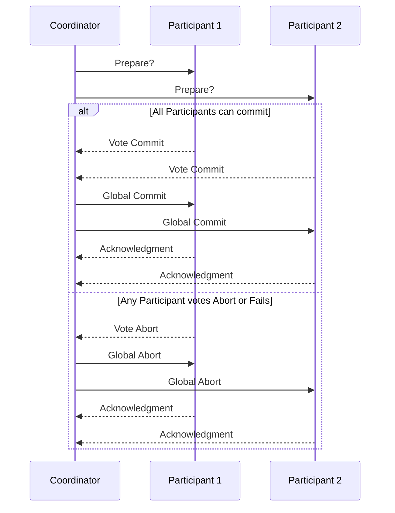

# Two-Phase Commit (2PC)

## Core

**Two-Phase Commit (2PC)** is a classic atomic commitment protocol that ensures all participating nodes in a distributed transaction either commit or abort the transaction together. It is designed to guarantee atomicity across multiple participants, even in the face of failures.

The protocol involves a coordinator and multiple participants. It operates in two distinct phases:

### Phase 1: Commit-Request (Vote) Phase

1.  **Coordinator sends prepare message:** The coordinator sends a "prepare" message to all participants, asking them to prepare to commit the transaction.
2.  **Participants vote:** Each participant executes the transaction up to the point of committing and writes all changes to a local undo log and a redo log. If a participant can successfully prepare, it replies with a "vote-commit" message to the coordinator and waits for the coordinator's decision. If it cannot prepare (e.g., due to a local failure or constraint violation), it replies with a "vote-abort" message.

### Phase 2: Commit Phase

1.  **Coordinator collects votes:** The coordinator collects all votes from the participants.
    *   **If all participants vote-commit:** The coordinator sends a "global-commit" message to all participants.
    *   **If any participant votes-abort (or fails to respond within a timeout):** The coordinator sends a "global-abort" message to all participants.
2.  **Participants act on decision:**
    *   **If global-commit:** Participants commit their local transaction and release any held resources. They then send an "acknowledgment" to the coordinator.
    *   **If global-abort:** Participants roll back their local transaction using the undo log and release any held resources. They then send an "acknowledgment" to the coordinator.
3.  **Coordinator finalizes:** The coordinator waits for acknowledgments from all participants before finalizing the transaction.

## Characteristics

- **Blocking**: 2PC is a blocking protocol; if the coordinator fails, participants may be blocked and unable to proceed.
- **Atomic**: All participants either commit or abort the transaction.
- **Consistent**: The protocol ensures that all participants reach a consistent decision.
- **Durable**: The outcome of the transaction is durable, even in the case of failures.
- **Centralized**: The protocol relies on a central coordinator to make the final decision.

## Comparison

| Protocol | Blocking | Complexity |
|---|---|---|
| **2PC** | Yes | Medium |
| **3PC** | No | High |

## Trade-offs

-   **High Latency:** The two-phase communication and blocking nature introduce significant latency, especially with many participants or high network delays.
-   **Blocking:** Participants hold resources (e.g., locks) during the entire protocol, which can lead to reduced concurrency and potential deadlocks if the coordinator fails.
-   **Single Point of Failure:** If the coordinator fails during the commit phase, participants may be left in an uncertain state, unable to commit or abort until the coordinator recovers or a recovery protocol is initiated.

## Use Case

-   **Distributed Databases:** Used in traditional distributed relational databases (e.g., XA transactions in Oracle, SQL Server) to maintain ACID properties across multiple database instances.
-   **Enterprise Systems:** Employed in enterprise application servers and transaction processing monitors where strong consistency and atomicity are critical for business operations.

