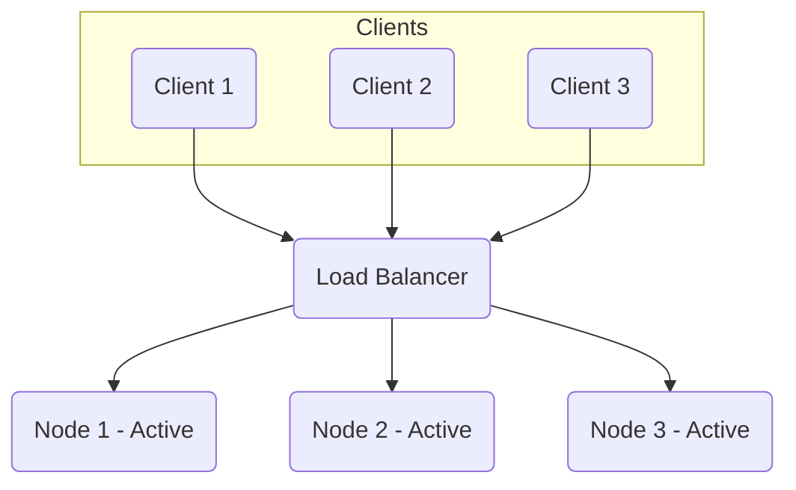

# Active-Active Cluster

This section describes the Active-Active Cluster configuration for fault tolerance, where multiple nodes are simultaneously active and capable of handling requests, providing high availability and improved performance.

## Characteristics

- **High Availability**: All nodes are active and can handle requests, providing high availability.
- **Load Balancing**: The workload is distributed across all active nodes, improving performance.
- **Scalability**: The cluster can be scaled by adding more active nodes.
- **Fault Tolerance**: The cluster is resilient to the failure of individual nodes.
- **Complexity**: Active-active clusters are more complex to manage than active-passive clusters.

## Comparison

| Feature | Description |
|---|---|
| **Availability** | High, all nodes are active. |
| **Performance** | Improved, workload distributed across nodes. |
| **Complexity** | High, requires robust conflict resolution and synchronization. |
| **Cost** | Higher, more resources are actively used. |

## Trade-offs

| Advantages | Disadvantages |
|---|---|
| **High Availability**: All nodes are active and can handle requests, providing high availability. | **Complexity**: Active-active clusters are more complex to manage than active-passive clusters. |
| **Load Balancing**: The workload is distributed across all active nodes, improving performance. | **Cost**: Active-active clusters are more expensive to operate. |
| **Scalability**: The cluster can be scaled by adding more active nodes. | **Consistency**: Maintaining data consistency across all active nodes can be challenging. |

## Which service use it?

-   **Load-Balanced Web Servers:** Multiple web servers running concurrently behind a load balancer, all actively serving user requests. If one server fails, the load balancer redirects traffic to the remaining active servers.

-   **Stateless Microservices:** Microservices designed to be stateless can easily be deployed in an active-active configuration, as any instance can handle any request without needing to maintain session-specific data locally.

-   **Distributed Caching Systems:** Caching solutions like Redis Cluster or Memcached can operate in an active-active manner, distributing cached data across multiple nodes, all of which are available for reads and writes.

-   **Multi-Master Databases:** Databases configured for multi-master replication (e.g., some NoSQL databases, PostgreSQL BDR) allow multiple nodes to accept writes simultaneously, forming an active-active setup for data modification.

-   **Global Traffic Management (GTM) for Geo-Redundancy:** Systems that direct user traffic to the closest or healthiest active data center, where each data center is an active cluster.

