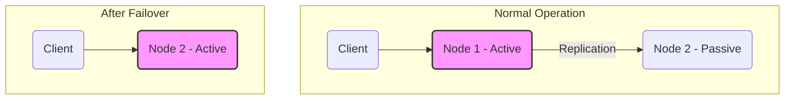

# Active-Passive Failover

This section describes Active-Passive Failover, a fault-tolerance strategy where a standby (passive) system takes over operations from a primary (active) system upon failure.

## Characteristics

- **High Availability**: Active-passive failover provides high availability by ensuring that a standby system is available to take over in case of a failure.
- **Fault Tolerance**: The system is resilient to the failure of the active node.
- **Redundancy**: The passive node is a redundant copy of the active node.
- **Consistency**: Data is replicated from the active node to the passive node to ensure consistency.
- **Failover**: The process of switching from the active node to the passive node is called failover.

## Pros & Cons

### Pros
-   **Simplicity:** Generally easier to set up, configure, and manage compared to more complex high-availability solutions like active-active.
-   **Clear Failover Mechanism:** The failover process is predictable, with a defined standby system ready to take over.
-   **Data Consistency:** Easier to maintain strong data consistency as only one node is actively writing at any given time, simplifying replication.
-   **Cost-Effective (in some cases):** The passive node might run with fewer resources or be a less powerful machine, potentially reducing costs compared to having two fully active systems.

### Cons
-   **Downtime During Failover:** There is an inevitable period of downtime during the switch from the active to the passive node, which can range from seconds to minutes.
-   **Resource Underutilization:** The passive server remains idle or underutilized, representing a wasted resource until a failover occurs.
-   **Limited Scalability:** Scaling typically involves upgrading the capacity of both the active and passive servers, rather than distributing the load across multiple active nodes.
-   **Potential for Data Loss:** If data replication to the passive node lags, there's a risk of losing recent transactions during a failover event.
-   **Failover Testing Complexity:** Thoroughly testing the failover process can be challenging and disruptive.

## Which service use it?

-   **Traditional Database High Availability:** Many relational databases (e.g., PostgreSQL, MySQL, SQL Server) are often deployed with an active-passive setup, where a primary database handles all operations and a standby replica takes over in case of primary failure.

-   **Application Servers:** Critical application instances can be configured with an active-passive failover, where a passive server is ready to take over the workload if the active one goes down.

-   **Network Devices:** Firewalls, routers, and load balancers often use active-passive configurations to ensure network connectivity and service availability.

-   **Virtual Machine Clusters:** Virtualization platforms (e.g., VMware vSphere, Microsoft Hyper-V) use active-passive failover to automatically restart virtual machines on healthy hosts if a host fails.

-   **Message Brokers:** Some message queue systems can be configured in an active-passive mode to ensure message durability and availability.

