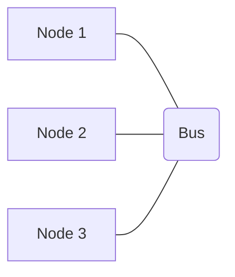

# Bus Topology

## Core

In a **Bus Topology**, all nodes in the network are connected to a single, shared communication line, often called the "bus" or "backbone." Data is transmitted along this central cable, and all nodes receive the transmission, but only the intended recipient processes it.

### Characteristics

-   **Shared Medium:** All devices share a single communication channel.
-   **Simplicity:** Easy to implement for small networks.
-   **Termination:** Both ends of the bus must be terminated to prevent signal reflection.

### How it Works

When a node wants to send data, it broadcasts the data onto the bus. All other nodes on the bus listen for data. If the data's destination address matches a node's address, that node accepts the data. If not, the node ignores the data.

### Advantages

-   **Easy to Install:** Requires less cabling than other topologies.
-   **Cost-Effective:** Lower cost for small networks.
-   **Linear Structure:** Simple to understand and manage.

### Disadvantages

-   **Single Point of Failure:** If the main bus cable breaks, the entire network goes down.
-   **Limited Scalability:** Performance degrades significantly with more nodes due to increased traffic and collisions.
-   **Difficult Troubleshooting:** Identifying cable faults can be challenging.
-   **Low Security:** All nodes can see all traffic on the bus.

## Use Cases

-   **Small, Temporary Networks:** Often used in environments where a quick and simple network setup is needed.
-   **Legacy Ethernet:** Early Ethernet implementations (10Base2, 10Base5) used a bus topology.
-   **Industrial Control Systems:** Sometimes found in specific industrial automation or embedded systems for connecting sensors and actuators.
