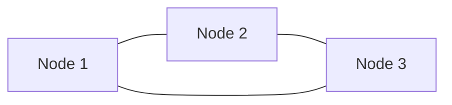

# Ring Topology

## Core

This section explains the Ring topology in distributed systems. In a ring topology, each device is connected to two other devices on either side of it.

## Trade-offs

- **Simplicity vs. Scalability**: Ring topology is simple, but it is not very scalable.
- **Cost vs. Performance**: Ring topology is cost-effective, but it does not offer good performance.

## Which service use it?

-   **Token Ring Networks:** Historically, Token Ring was a popular LAN technology that used a ring topology for data transmission.

-   **Storage Area Networks (SANs):** Some Fibre Channel SANs can be configured in a ring topology for high availability and performance.

-   **Distributed Hash Tables (DHTs):** Many DHT implementations (e.g., Chord, Pastry) conceptually form a ring structure to distribute data and facilitate lookups in peer-to-peer networks.

-   **Metropolitan Area Networks (MANs):** In some urban areas, fiber optic networks are laid out in a ring topology to provide high-speed and resilient connectivity.

-   **Apache Cassandra:** While Cassandra's architecture is more complex, its data distribution and replication model can be conceptually mapped to a ring (or torus) where nodes are responsible for a range of data.
