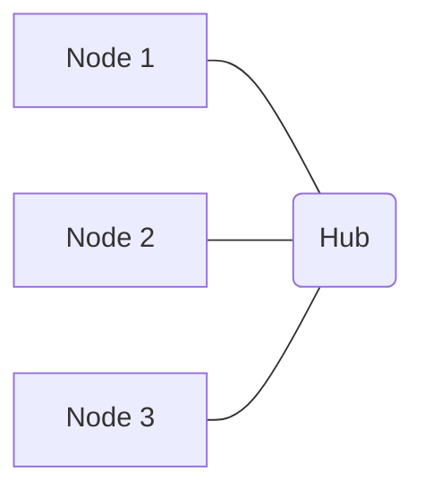

# Star Topology

In a **Star Topology**, all nodes in the network are individually connected to a central device, such as a hub, switch, or router. This central device acts as a server, relaying all communications between the connected nodes.

### How it Works

When a node sends data, it transmits it to the central hub. The hub then forwards the data to the intended destination node. In a modern star topology using a switch, the switch learns the MAC addresses of connected devices and forwards traffic only to the intended recipient, improving efficiency.

### Advantages

-   **Easy to Install and Manage:** Simple to add or remove nodes without affecting the rest of the network.
-   **Fault Isolation:** A failure in one node's connection does not affect other nodes.
-   **Easy Troubleshooting:** Identifying faulty nodes or connections is straightforward.
-   **High Performance (with Switch):** Dedicated connections to a switch can provide good performance, as traffic is not broadcast to all nodes.

### Disadvantages

-   **Single Point of Failure:** If the central hub or switch fails, the entire network goes down.
-   **Increased Cabling:** Requires more cable than a bus topology.
-   **Cost:** The central connecting device (hub/switch) adds to the overall cost.
-   **Performance Bottleneck:** The central device can become a bottleneck if it cannot handle the traffic load from all connected nodes.

## Use Cases

-   **Local Area Networks (LANs):** The most common topology for modern home and office Ethernet networks.
-   **Client-Server Networks:** Ideal for environments where a central server manages resources and clients access them.
-   **Small to Medium-Sized Businesses:** Provides a good balance of performance, reliability, and ease of management for typical business needs.

## Characteristics

- **Centralized**: All nodes are connected to a central hub.
- **Simplicity**: Star topology is simple to install and manage.
- **Reliability**: The failure of a single node does not affect the rest of the network.
- **Scalability**: It is easy to add new nodes to the network.
- **Single Point of Failure**: The central hub is a single point of failure.

## Comparison

| Topology | Reliability | Scalability | Cost | Complexity |
|---|---|---|---|---|
| **Star** | Medium | Medium | Medium | Medium |
| **Bus** | Low | Low | Low | Low |
| **Ring** | Medium | Low | Medium | Medium |
| **Mesh** | High | Low | High | High |

## Trade-offs

- **Reliability vs. Single Point of Failure**: The failure of a single node does not affect the rest of the network, but the central hub is a single point of failure.
- **Scalability vs. Performance**: It is easy to add new nodes to the network, but the performance of the network can degrade as more nodes are added.

## Which service use it?

-   **Local Area Networks (LANs):** The most common topology for modern wired LANs, where all computers and network devices connect to a central switch or hub.

-   **Client-Server Architectures:** In a client-server model, the server acts as the central hub, and all clients connect to it to request services.

-   **Centralized Monitoring Systems:** Monitoring agents on various machines report to a central monitoring server, forming a star-like communication pattern.

-   **Home Networks:** Most home Wi-Fi networks are essentially star topologies, with all devices connecting to the central router.

-   **Cloud Computing (Conceptual):** In many cloud deployments, virtual machines or containers communicate with central services (e.g., load balancers, databases, API gateways) in a star-like fashion.
