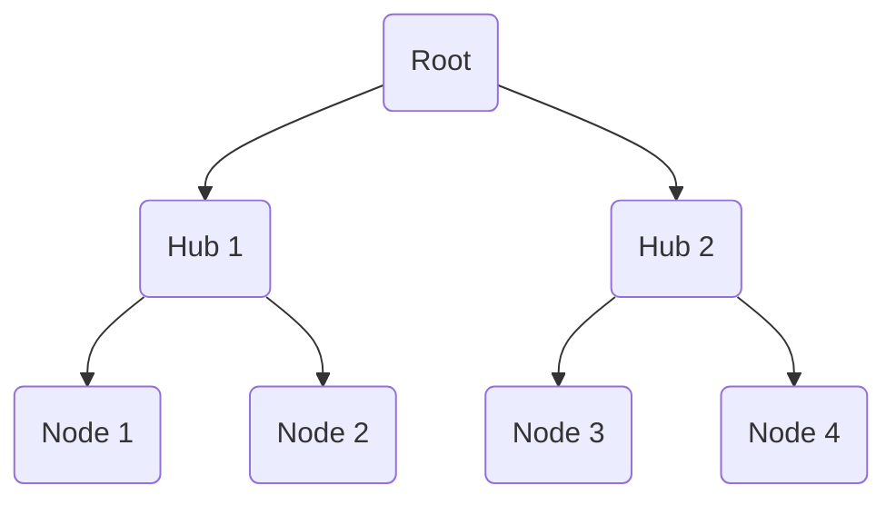

# Tree Topology

## Core

A **Tree Topology** is a hybrid topology that combines characteristics of both bus and star topologies. It is essentially a collection of star networks arranged in a hierarchical structure, with a central root node and branches extending outwards. Each branch can further subdivide into more branches or connect to individual nodes.

### Characteristics

-   **Hierarchical Structure:** Nodes are organized in levels, with a root node at the top.
-   **Central Backbone (Bus-like):** The main cable connecting the primary hubs often resembles a bus.
-   **Star-like Branches:** Individual nodes connect to local hubs, forming star segments.

### How it Works

Data flows from the root down to the branches and vice-versa. Each hub acts as a repeater, forwarding data to its connected nodes or up the hierarchy. This structure allows for efficient management of larger networks by segmenting them into smaller, more manageable star networks.

### Advantages

-   **Scalability:** Easy to expand by adding new branches or star segments.
-   **Fault Isolation:** A failure in one branch or star segment does not necessarily affect the entire network.
-   **Centralized Management:** Easier to manage and maintain than a mesh topology.
-   **Point-to-Point Wiring for Segments:** Each star segment benefits from the advantages of a star topology.

### Disadvantages

-   **Single Point of Failure (Root/Backbone):** If the central root or the main backbone cable fails, large portions of the network can become inoperable.
-   **Complex Implementation:** More complex to set up and configure than simple bus or star topologies.
-   **Cost:** Requires more cabling and networking equipment (hubs/switches) than a bus topology.
-   **Performance Dependent on Root:** The performance of the entire network can be affected by the capacity of the central root and backbone.

## Use Cases

-   **Large Corporate Networks:** Commonly used in large organizations to connect different departments or buildings.
-   **Campus Networks:** Connecting multiple buildings within a university or corporate campus.
-   **Hierarchical Network Architectures:** Any network design that requires a structured, layered approach to connectivity.
-   **Broadband Networks:** Often used by internet service providers to distribute services to subscribers.
