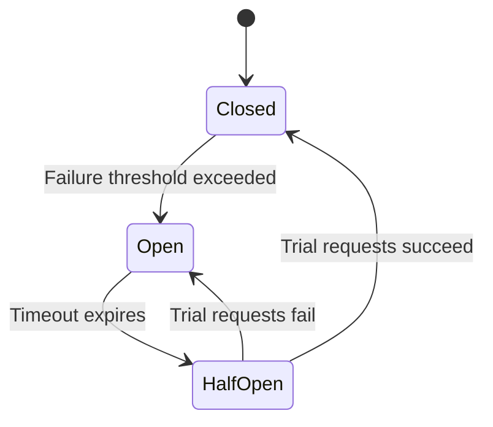

# Circuit Breaker Pattern

## Core

The Circuit Breaker is a design pattern used in distributed systems to detect failures and prevent a client from repeatedly trying to call a service that is likely to fail. Just like an electrical circuit breaker, it interrupts the flow of requests to a failing service when a certain threshold of failures is reached, preventing a cascade of failures across the system.

This pattern is essential for building resilient and fault-tolerant applications, as it gives a struggling downstream service time to recover by shedding its load.

## Characteristics

The Circuit Breaker pattern operates as a state machine with three distinct states:

*   **Closed:** This is the normal, default state. All requests are routed to the downstream service as usual. The circuit breaker monitors the number of failures (e.g., timeouts, HTTP 5xx errors) within a specific time window. If the number of failures exceeds a pre-configured threshold, the breaker "trips" and moves to the **Open** state.

*   **Open:** In this state, the circuit breaker immediately rejects all requests to the downstream service without attempting to call it. This is the "tripped" state. It returns an error or a fallback response to the client. The breaker remains in this state for a configured timeout period. This timeout gives the downstream service time to recover from its issues without being overwhelmed by new requests. After the timeout expires, the breaker moves to the **Half-Open** state.

*   **Half-Open:** In this state, the circuit breaker allows a limited number of test requests to pass through to the downstream service. This is a trial period to check if the service has recovered.
    *   If these trial requests succeed, the circuit breaker assumes the service is healthy again and transitions back to the **Closed** state, resuming normal operation.
    *   If any of the trial requests fail, the breaker trips again and returns to the **Open** state, restarting the recovery timer.

## Comparison

The Circuit Breaker pattern is often used in conjunction with other resilience patterns.

*   **Circuit Breaker vs. Retry Pattern:** The Retry pattern is useful for handling transient, temporary failures by resending a request a few times. However, if a service is experiencing a major outage, continuously retrying will only worsen the problem by consuming resources and adding more load. A circuit breaker wraps the retry logic. It allows a few retries when the circuit is **Closed**, but it stops all requests when the circuit is **Open**, preventing futile retries.

*   **Circuit Breaker vs. Timeout Pattern:** Timeouts are crucial for preventing a client from waiting indefinitely for a response from a slow or unresponsive service. The circuit breaker uses timeouts as one of its key signals for detecting failures. While timeouts protect the client from a single slow request, the circuit breaker protects the entire system from a chronically failing service.

## Trade-offs

Implementing the Circuit Breaker pattern involves several trade-offs.

*   **Pros:**
    *   **Improved Resilience:** Prevents cascading failures where a failure in one service triggers failures in other dependent services.
    *   **Fault Tolerance:** Allows the system to gracefully handle service unavailability and degradation without a complete breakdown.
    *   **Fast Failures:** When the circuit is open, requests fail immediately, which is often a better user experience than a long wait followed by a timeout.
    *   **Automatic Recovery:** The pattern allows the system to automatically detect when a failing service has recovered and resume normal operations without manual intervention.

*   **Cons:**
    *   **Increased Complexity:** Implementing and managing the state of the circuit breaker adds complexity to the client-side communication logic. This is often mitigated by using mature libraries (e.g., Polly in .NET, Hystrix in Java) or service mesh technologies that provide this functionality out of the box.
    *   **Configuration Tuning:** The pattern requires careful tuning of its parameters, such as the failure threshold, the open-state timeout, and the number of trial requests in the half-open state. Poorly configured parameters can either trip the breaker too often or not quickly enough.
    *   **Fallback Logic:** To provide a good user experience, it's often necessary to implement fallback logic (e.g., returning cached data or a default message) for when the circuit is open, which adds to the development effort.
