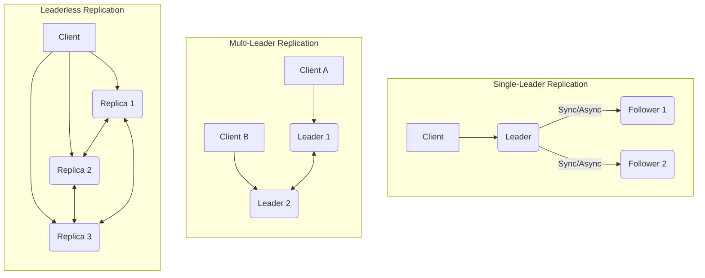

# Data Replication

**Data replication** is the process of storing copies of the same data on multiple nodes in a distributed system. This is a fundamental technique for building fault-tolerant, available, and high-performance systems.

## Key Considerations

-   **Consistency Model:** The chosen consistency model (e.g., strong, eventual) directly impacts how replicas are synchronized and how conflicts are handled.
-   **Replication Lag:** The delay between an update being applied to the primary replica and its propagation to secondary replicas.
-   **Conflict Resolution:** Mechanisms for resolving inconsistencies that arise when multiple replicas are updated concurrently.
-   **Network Overhead:** The bandwidth and latency costs associated with transmitting data between replicas.
-   **Fault Tolerance:** How replication contributes to the system's ability to withstand node failures and data loss.
-   **Scalability:** How replication strategies support scaling read and write operations.

## Comparison

| Strategy | Consistency | Performance | Complexity | Use Case |
|---|---|---|---|---|
| **[Synchronous](./sync)** | Strong | Low | Low | Financial systems, critical data |
| **[Asynchronous](./async)** | Eventual | High | Low | Caching, non-critical data |
| **[Semi-Synchronous](./semi-sync)** | Stronger than eventual | Medium | Medium | E-commerce, online gaming |
| **[Multi-Leader](./multi-leader)** | Eventual | High | High | Multi-datacenter deployments |
| **[Multi-Source](./multi-source)** | Eventual | High | High | Data aggregation, complex data flows |
| **[CRDT](./crdt)** | Eventual | High | High | Collaborative applications, leveraging their conflict-free nature as discussed in [Conflict Resolution](../conflict-resolution/README.md) and as a [Coordination](../coordination/README.md) mechanism |

