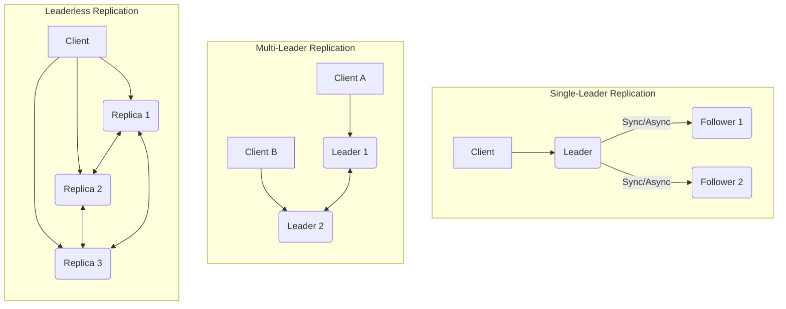

# Data Replication

**Data replication** is the process of storing copies of the same data on multiple nodes in a distributed system. This is a fundamental technique for building fault-tolerant, available, and high-performance systems.

### Key Considerations

-   **Consistency Model:** The chosen consistency model (e.g., strong, eventual) directly impacts how replicas are synchronized and how conflicts are handled.
-   **Replication Lag:** The delay between an update being applied to the primary replica and its propagation to secondary replicas.
-   **Conflict Resolution:** Mechanisms for resolving inconsistencies that arise when multiple replicas are updated concurrently.
-   **Network Overhead:** The bandwidth and latency costs associated with transmitting data between replicas.
-   **Fault Tolerance:** How replication contributes to the system's ability to withstand node failures and data loss.
-   **Scalability:** How replication strategies support scaling read and write operations.

## Characteristics

- **Fault Tolerance**: Replication provides fault tolerance by ensuring that data is available even if some nodes fail.
- **Availability**: Replication increases the availability of data by providing multiple copies.
- **Performance**: Replication can improve read performance by allowing reads to be served from multiple nodes.
- **Consistency**: Replication can introduce consistency issues, as different replicas may have different versions of the data.
- **Cost**: Replication increases the cost of the system, as it requires additional storage and network resources.

## Comparison

| Strategy | Consistency | Performance | Complexity | Use Case |
|---|---|---|---|---|
| **[Synchronous](./sync)** | Strong | Low | Low | Financial systems, critical data |
| **[Asynchronous](./async)** | Eventual | High | Low | Caching, non-critical data |
| **[Semi-Synchronous](./semi-sync)** | Stronger than eventual | Medium | Medium | E-commerce, online gaming |
| **[Multi-Leader](./multi-leader)** | Eventual | High | High | Multi-datacenter deployments |
| **[Multi-Source](./multi-source)** | Eventual | High | High | Data aggregation, complex data flows |
| **[CRDT](./crdt)** | Eventual | High | High | Collaborative applications, leveraging their conflict-free nature as discussed in [Conflict Resolution](../conflict-resolution/README.md) and as a [Coordination](../coordination/README.md) mechanism |

## Trade-offs

- **Consistency vs. Performance**: Stronger consistency models typically have lower performance.
- **Consistency vs. Availability**: Stronger consistency models typically have lower availability.
- **Cost vs. Fault Tolerance**: Higher levels of fault tolerance typically require more replicas and higher costs.

## Which service use it?

-   **Synchronous Replication:** Used in systems requiring strong consistency and zero data loss, such as financial transaction systems, critical enterprise databases, and distributed consensus systems.
-   **Asynchronous Replication:** Common in web applications, caching layers, and analytics databases where high write throughput and low latency are prioritized over immediate consistency. Also used for disaster recovery where some data loss is acceptable.
-   **Semi-Synchronous Replication:** Often found in relational databases (e.g., MySQL, PostgreSQL) to provide a balance between consistency and performance, ensuring at least one replica has received the data before committing.
-   **Multi-Leader Replication:** Employed in geographically distributed systems or multi-datacenter deployments where local writes need to be fast and available. For instance, an e-commerce platform with data centers in different regions might use multi-leader replication to allow users in each region to write to their local database replica, with changes asynchronously replicated to other regions. Conflicts (e.g., two users buying the last item simultaneously from different regions) are resolved later, often using techniques like Last-Write-Wins or custom application logic (e.g., some NoSQL databases, distributed file systems).
-   **Multi-Source Replication:** Used in data warehousing, data integration scenarios, or complex ETL (Extract, Transform, Load) pipelines where data from various sources needs to be consolidated into a single target.
-   **CRDT (Conflict-free Replicated Data Types):** Ideal for collaborative applications (e.g., real-time text editors, shared whiteboards), distributed counters, and other scenarios where concurrent updates need to be merged automatically without manual conflict resolution.

