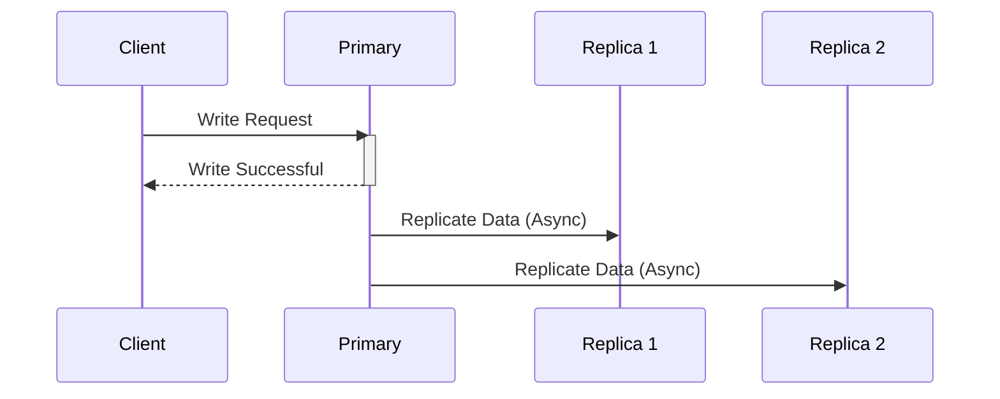

# Asynchronous Replication

## Core

This section describes Asynchronous Replication, a data replication mode where the primary node commits a transaction before receiving confirmation that the replica nodes have received or applied the changes, prioritizing performance and availability over immediate consistency.

## Characteristics

- **Eventual Consistency**: Asynchronous replication provides eventual consistency, as there is a delay in propagating changes to replicas.
- **High Performance**: Write operations have low latency, as they do not need to wait for acknowledgment from replicas.
- **Data Loss**: There is a potential for data loss if the primary node fails before the changes are propagated to the replicas.
- **Simplicity**: Asynchronous replication is simpler to implement and manage than synchronous replication.
- **High Availability**: The system can remain available for writes even if a replica node fails.

## Comparison

| Feature | Description |
|---|---|
| **Consistency** | Eventual consistency. |
| **Performance** | High write throughput, low latency. |
| **Data Loss** | Potential for data loss on primary failure. |
| **Complexity** | Relatively simple to implement. |

## Trade-offs

- **Performance vs. Consistency**: Asynchronous replication provides high performance, but it provides weaker consistency guarantees.
- **Availability vs. Consistency**: Asynchronous replication provides high availability, but it provides weaker consistency guarantees.

## Which service use it?

-   **Web Applications:** Many large-scale web applications use asynchronous replication for their databases to handle high write throughput and distribute read loads, accepting eventual consistency.

-   **Caching Layers:** Distributed caches often use asynchronous replication to propagate updates to cached data across multiple nodes, prioritizing low latency for writes.

-   **Analytics Databases and Data Warehouses:** Data is often asynchronously replicated from operational databases to analytical systems, where immediate consistency is less critical than data volume and query performance.

-   **Disaster Recovery (DR) Setups:** Asynchronous replication is commonly used for DR sites, where the primary goal is to have a recent copy of data available in case of a catastrophic failure, even if it means some potential data loss.

-   **Content Delivery Networks (CDNs):** Content updates are asynchronously replicated to edge servers around the globe.

## Related Concepts

-   **Eventual Consistency:** Asynchronous replication is a primary mechanism for achieving eventual consistency, where data across replicas converges over time rather than immediately. [Learn more about Eventual Consistency](../../consistency-models/eventual-consistency/README.md).

-   **Synchronous Replication:** In contrast, synchronous replication ensures that all replicas are updated before a transaction is committed, prioritizing strong consistency over performance. [Compare with Synchronous Replication](../sync/README.md).

-   **Semi-Synchronous Replication:** A hybrid approach that offers a balance between the consistency guarantees of synchronous replication and the performance benefits of asynchronous replication. [Explore Semi-Synchronous Replication](../semi-sync/README.md).

-   **Fault Tolerance:** Asynchronous replication plays a crucial role in disaster recovery and high availability strategies, allowing systems to recover from failures by having data replicated to other nodes. [Understand Fault Tolerance](../../fault-tolerance/README.md).
