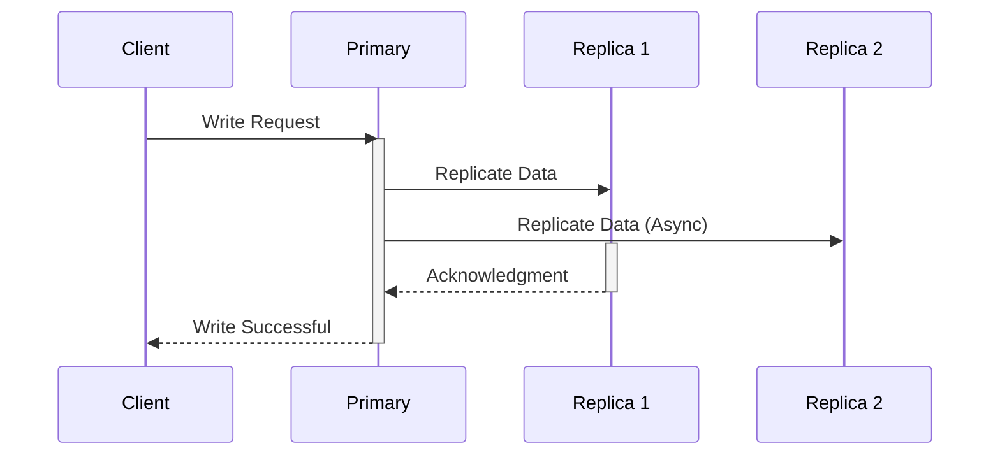

# Semi-Synchronous Replication

## Core

This section explains Semi-Synchronous Replication, a data replication mode that offers a balance between synchronous and asynchronous replication, providing stronger consistency guarantees than async without the full latency impact of sync.

## Characteristics

- **Reduced Data Loss**: Semi-synchronous replication reduces the risk of data loss compared to asynchronous replication.
- **Improved Consistency**: It provides stronger consistency guarantees than asynchronous replication.
- **Moderate Latency**: Write operations have moderate latency, as they must be acknowledged by at least one replica.
- **Moderate Availability**: The system may become unavailable if the replica node fails.
- **Moderate Complexity**: It is more complex to implement and manage than asynchronous replication.

## Comparison

| Feature | Description |
|---|---|
| **Consistency** | Stronger than eventual, weaker than strong. |
| **Performance** | Better than synchronous, worse than asynchronous. |
| **Data Loss** | Reduced risk compared to asynchronous. |
| **Complexity** | More complex than asynchronous, less than synchronous. |

## Trade-offs

- **Consistency vs. Performance**: Semi-synchronous replication provides a balance between consistency and performance.
- **Consistency vs. Availability**: It provides a balance between consistency and availability.

## Which service use it?

-   **Relational Databases (e.g., MySQL, PostgreSQL):** These databases often offer semi-synchronous replication as a built-in feature to provide a middle ground between the performance of asynchronous and the data safety of synchronous replication.

-   **E-commerce Platforms:** For critical operations like order placement or inventory updates, semi-synchronous replication can ensure that data is safely replicated to at least one other node before the transaction is committed, reducing the risk of data loss compared to pure asynchronous replication.

-   **Online Gaming:** In some online games, certain critical game state updates might use semi-synchronous replication to ensure a higher degree of consistency among players without incurring the full latency of synchronous replication.

-   **Content Management Systems (CMS):** For content updates that are important but not absolutely real-time critical, semi-synchronous replication can provide better data durability than asynchronous replication.

