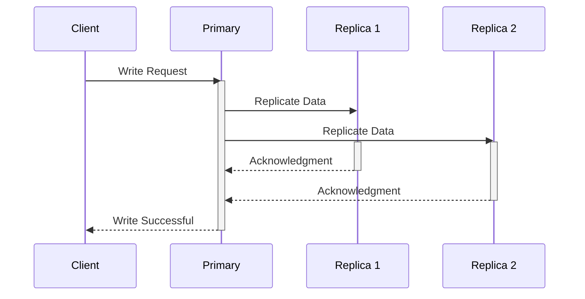

# Synchronous Replication

## Core

This section describes Synchronous Replication, a data replication mode where the primary node waits for confirmation from replica nodes that they have received and committed the transaction before committing itself, prioritizing strong consistency.

## Characteristics

- **Strong Consistency**: Synchronous replication provides strong consistency, as all replicas are guaranteed to be up-to-date.
- **Zero Data Loss**: There is no data loss in the event of a primary node failure.
- **High Latency**: Write operations have higher latency, as they must be acknowledged by all replicas.
- **Low Availability**: The system may become unavailable if a replica node fails.
- **Complexity**: Synchronous replication is more complex to implement and manage than asynchronous replication.

## Comparison

| Feature | Description |
|---|---|
| **Consistency** | Strong consistency, zero data loss. |
| **Performance** | Higher latency for writes. |
| **Availability** | Reduced availability during replica failures. |
| **Complexity** | More complex to implement and manage. |

## Trade-offs

- **Consistency vs. Performance**: Synchronous replication provides strong consistency, but it has higher latency than asynchronous replication.
- **Consistency vs. Availability**: Synchronous replication provides strong consistency, but it may become unavailable if a replica node fails.

## Which service use it?

-   **Financial Transaction Systems:** Banking, trading, and payment processing systems where data integrity and zero data loss are absolutely critical. Transactions must be committed on multiple nodes before being acknowledged to the client.

-   **Critical Enterprise Databases:** Databases storing highly sensitive or business-critical information where any data loss or inconsistency could have severe consequences.

-   **Distributed Consensus Systems (e.g., Paxos, Raft):** While not strictly a replication strategy in the same sense as database replication, consensus algorithms inherently use synchronous communication to ensure all participants agree on a state before proceeding.

-   **High-Availability Clusters:** In active-passive or active-active setups for critical applications, synchronous replication ensures that the standby node always has an up-to-date copy of the data.

